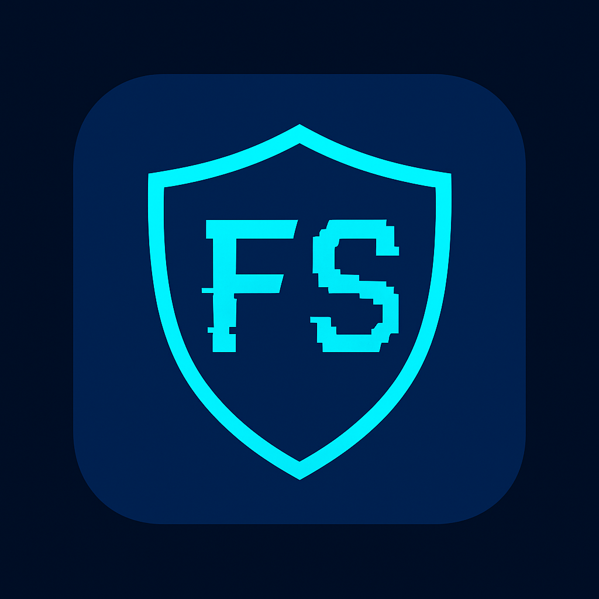
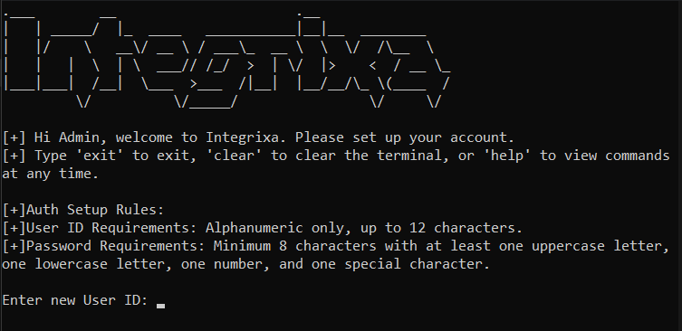

  

**Integrixa** is a **Windows-only**, CLI-based **defensive cybersecurity tool** designed to help system administrators and security-conscious users **monitor file integrity in real time**.  
It runs as a **persistent background daemon**, constantly watching for unauthorized file changes using **SHA-256 cryptographic hashing**. Upon detecting tampering, it sends **instant Telegram alerts** and logs the event for forensic review. Integrixa interacts with the Windows operating system using Python's built-in modules like os, os.path, hashlib, ctypes,psutil, subprocess, and datetime, enabling file path validation, system privilege checks, secure file I/O, daemon-like behavior, and automated task scheduling.

---

## 🔧 What It Does

-  Monitors user-specified and default critical system file paths
-  Detects unauthorized modifications using SHA-256 hash comparisons
-  Sends real-time **Telegram alerts** on file tampering
-  Provides an **admin-authenticated CLI** interface for secure management
-  Maintains logs for:
    - Authentication attempts  
    - File monitoring activity  
    - Telegram alerts (successful & failed)
-  **Self-monitors** to resist unauthorized shutdown or tampering
-  Auto-starts monitoring daemon on every system boot
-  Automatically purges all logs older than **2 days**

---

## ✅ Current Features

-  **Real-time file integrity monitoring** through a secure daemon
-  Password-protected & user ID-based **authentication system**
-  Telegram Bot integration for **instant notifications**
-  **Fallback logging** if Telegram alert fails
-  **Default file list protection** + **user-added custom paths**
-  Encrypted configuration storage (Telegram tokens, password hash, etc.)
-  **Hash baseline updating** — update current file hash as new trusted baseline
-  CLI menu to:
    - Add file path to monitor  
    - View all monitored files  
    - Remove custom file paths  
-  Clean modular codebase for easy future extension
-  Initial setup auto-installs necessary files and permissions with **admin rights**
-  Program resists unauthorized access and modification (even by admin without CLI auth)

---

## ⚠️ Important Notes

-  Public contributions, suggestions, and feature requests are **welcome**!
-  Built for **educational**, **research**, and **defensive security** purposes
-  Must be run with **Administrator privileges**
-  Currently supports **Windows OS only**

---

## 🚀 Getting Started

To install and use Integrixa:

1. Download and Extract the Package:
   - Download Integrixa_Package.zip from the Release v1 section and extract it.
   - After extraction. ensure the folder structure is as follow:
      - The main folder should contain Integrixa.exe
      - Inside the main folder, there should be a service subfolder containing: monitor.exe and watchdog.exe
2. Double click the Integrixa.exe file to begin setup:
    - Set your User ID and Password
    - Configure your Telegram Bot ID and Chat ID
    - Add the file paths you want to monitor
    - Choose to start monitoring.
3. Done! Monitoring will now begin automatically on every system boot.
  - This setup creates two background processes:
    - monitor.exe- Monitor the specified files for any changes. 
    - watchdog.exe - Ensures that monitor.exe is always running. If it stops or crashes watchdog.exe automatically restarts it and sends a Telegram alert.
    - This mechanism ensures tamper-proof, continous file integrity monitoring.

---

## 📌 Stay Updated
Integrixa's first stable release is live!
Feel free to test, send feedback, or even collaborate with us by emailing:

📬 jeevanparajuli856@gmail.com

If you like the project, consider ⭐️ starring the repo to stay updated on future features and releases.